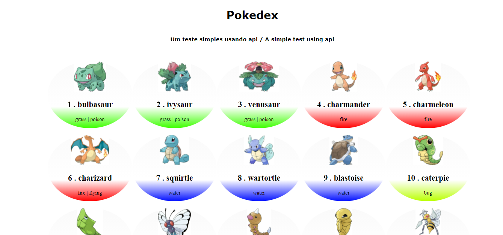

<h1 align="center">Pokedex</h1>

  
  <a aria-label="HTML5" href="#">
    </img>
  </a>
  <a aria-label="CSS3" href="#">
    </img>
  </a>
   <a aria-label="Javascript" href="#">
    </img>
  </a>
  <a aria-label="um dia" href="#">
    </img>
  </a>

## Projetos

Este repositório contém um teste simples de api criado com base na incrível video aulo do professor [Roger Melo](https://youtu.be/Uptu3NrBFBM)

## Print do projeto

## Projeto in live

É possivel vizualizar o projeto in live por [Projeto](https://ddparkas.github.io/pokedex/)

## Licença

[MIT](./LICENSE) &copy; [Daniel Dormin](https://ddparkas.github.io/site/)